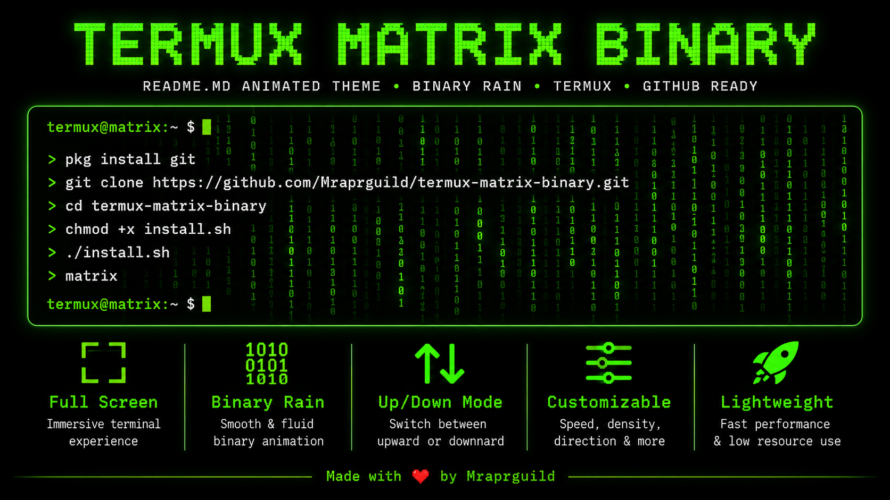
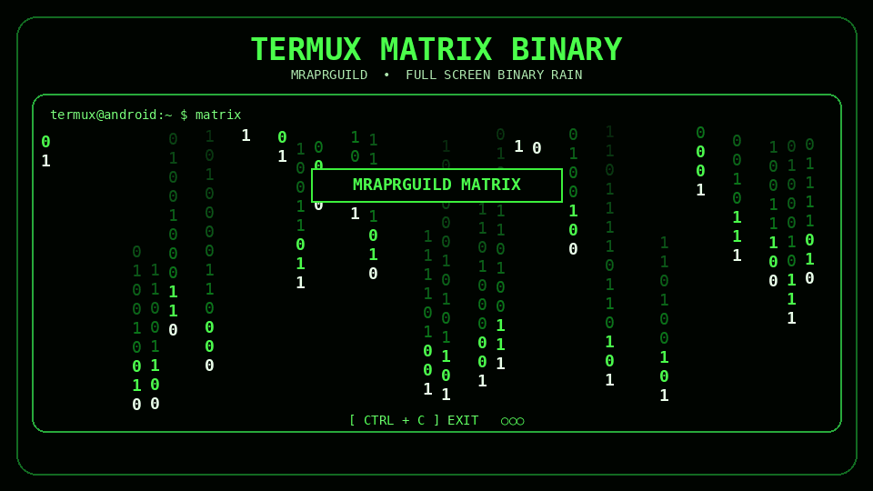
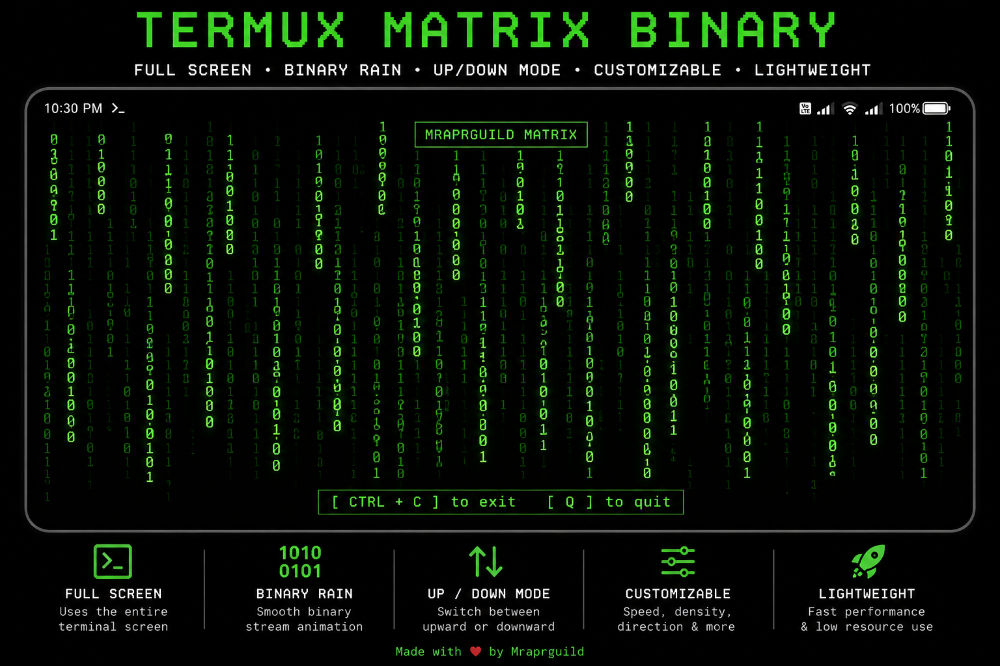

<div align="center">



# 🟢 Termux Matrix Binary Rain

### A full-screen Matrix-style `0` and `1` animation built for Termux

[](https://termux.dev/)
[](matrix.sh)
[](LICENSE)
[](https://github.com/Mraprguild)

**Full screen • Binary rain • Up/down mode • Adjustable speed • Lightweight**

</div>

---

## 🎬 Animated Preview

<div align="center">



</div>

> The GIF is a project preview. The real animation runs directly inside the Termux terminal and automatically adapts to the current terminal size.

---

## ✨ Features

- Full-screen Matrix-inspired terminal animation
- Random animated binary characters: `0` and `1`
- Bright stream heads with fading green trails
- Upward scrolling mode enabled by default
- Optional downward scrolling mode
- Adjustable animation speed and stream density
- Optional centered `MRAPRGUILD MATRIX` title
- Automatic handling of terminal-size changes
- Alternate-screen support that restores the original terminal
- Cursor hiding and safe cursor restoration
- Clean `CTRL + C` exit handling
- Lightweight Bash implementation
- Global `matrix` command installer
- Simple uninstall script
- No Python, Node.js, or heavy framework required

---

## 📱 Screenshot

<div align="center">



</div>

---

## 📦 Requirements

| Requirement | Details |
|---|---|
| Device | Android phone or tablet |
| Terminal | Termux |
| Shell | Bash |
| Packages | Git for cloning the repository |
| Root | Not required |

For security and compatibility, use a current Termux release from its official distribution channels.

---

## 🚀 Quick Installation

Copy and run these commands in Termux:

```bash
pkg update -y
pkg install git -y
git clone https://github.com/Mraprguild/termux-matrix-binary.git
cd termux-matrix-binary
chmod +x install.sh
./install.sh
matrix
```

Stop the animation with:

```text
CTRL + C
```

---

## 🧰 Installation Methods

### Method 1: Install the global command

```bash
git clone https://github.com/Mraprguild/termux-matrix-binary.git
cd termux-matrix-binary
chmod +x install.sh
./install.sh
```

After installation, launch it from any directory:

```bash
matrix
```

### Method 2: Run without installation

```bash
git clone https://github.com/Mraprguild/termux-matrix-binary.git
cd termux-matrix-binary
chmod +x matrix.sh
./matrix.sh
```

### Method 3: Update an existing clone

```bash
cd termux-matrix-binary
git pull
chmod +x install.sh
./install.sh
```

---

## 🎮 Usage

Run with the default settings:

```bash
matrix
```

Run the local script directly:

```bash
./matrix.sh
```

Exit safely:

```text
CTRL + C
```

---

## ⚙️ Customization

The script supports environment variables, so settings can be changed without editing the source code.

### Animation speed

Lower values produce faster animation:

```bash
MATRIX_SPEED=0.02 matrix
```

Slower animation:

```bash
MATRIX_SPEED=0.08 matrix
```

Default:

```text
0.045
```

### Stream density

More streams:

```bash
MATRIX_DENSITY=1 matrix
```

Fewer streams:

```bash
MATRIX_DENSITY=3 matrix
```

Default:

```text
2
```

### Direction

Upward binary rain:

```bash
MATRIX_DIRECTION=up matrix
```

Downward binary rain:

```bash
MATRIX_DIRECTION=down matrix
```

### Title visibility

Show the title:

```bash
MATRIX_SHOW_TITLE=1 matrix
```

Hide the title:

```bash
MATRIX_SHOW_TITLE=0 matrix
```

### Combine multiple options

```bash
MATRIX_SPEED=0.025 \
MATRIX_DENSITY=1 \
MATRIX_DIRECTION=down \
MATRIX_SHOW_TITLE=1 \
matrix
```

---

## 🧪 Example Presets

### Fast and dense

```bash
MATRIX_SPEED=0.018 MATRIX_DENSITY=1 matrix
```

### Slow cinematic mode

```bash
MATRIX_SPEED=0.09 MATRIX_DENSITY=2 matrix
```

### Minimal mode

```bash
MATRIX_SPEED=0.05 MATRIX_DENSITY=4 MATRIX_SHOW_TITLE=0 matrix
```

### Reverse rain

```bash
MATRIX_DIRECTION=down MATRIX_SPEED=0.035 matrix
```

---

## 🔁 Start Automatically with Termux

### Bash

```bash
echo 'matrix' >> ~/.bashrc
```

### Zsh

```bash
echo 'matrix' >> ~/.zshrc
```

Remove automatic startup:

```bash
sed -i '/^matrix$/d' ~/.bashrc ~/.zshrc 2>/dev/null
```

> Automatic startup means the animation launches every time that shell opens. Press `CTRL + C` to return to the prompt.

---

## 🗑️ Uninstall

From the cloned project directory:

```bash
chmod +x uninstall.sh
./uninstall.sh
```

Manual removal:

```bash
rm -f "$PREFIX/bin/matrix"
```

The cloned repository can then be removed:

```bash
cd ..
rm -rf termux-matrix-binary
```

---

## 📁 Project Structure

```text
termux-matrix-binary/
├── assets/
│   ├── banner.png
│   ├── matrix-demo.gif
│   └── screenshot.png
├── .gitignore
├── install.sh
├── uninstall.sh
├── matrix.sh
├── LICENSE
└── README.md
```

### File descriptions

| File | Purpose |
|---|---|
| `matrix.sh` | Main full-screen Matrix animation |
| `install.sh` | Installs the global `matrix` command |
| `uninstall.sh` | Removes the installed command |
| `assets/matrix-demo.gif` | Animated README preview |
| `assets/banner.png` | GitHub README header image |
| `assets/screenshot.png` | Static project screenshot |
| `LICENSE` | MIT License |
| `README.md` | Complete project documentation |

---

## 🛠️ How It Works

The Bash script reads the terminal width and height using `tput`. It creates multiple independent streams and assigns each stream a random position, length, and movement speed.

Each animation frame:

1. Selects a random binary character.
2. Draws a bright stream head.
3. Draws progressively darker trail characters.
4. Removes the previous tail character.
5. Moves the stream in the selected direction.
6. Wraps streams around the terminal boundaries.
7. Redraws the optional project title.

ANSI escape sequences are used for cursor positioning, terminal colors, alternate-screen mode, and cursor visibility.

---

## 🔐 Safety and Terminal Restoration

The script registers cleanup handlers for interruption and termination signals. When the animation exits normally, it:

- Resets terminal colors
- Restores the cursor
- Leaves the alternate terminal screen
- Returns to the original command prompt

The project does not require root access and does not modify Android system files.

---

## 🩺 Troubleshooting

### Permission denied

```bash
chmod +x matrix.sh install.sh uninstall.sh
```

### `matrix: command not found`

Reinstall the command:

```bash
./install.sh
hash -r
```

Verify that Termux can find it:

```bash
command -v matrix
```

Expected location:

```text
/data/data/com.termux/files/usr/bin/matrix
```

### Terminal display remains distorted

```bash
reset
```

Or close and reopen the Termux session.

### Animation is too slow

```bash
MATRIX_SPEED=0.02 MATRIX_DENSITY=3 matrix
```

### Animation consumes too much CPU

Increase the frame delay and reduce stream density:

```bash
MATRIX_SPEED=0.08 MATRIX_DENSITY=4 matrix
```

### Git reports that the folder already exists

Update the existing repository instead:

```bash
cd termux-matrix-binary
git pull
```

---

## 🧑‍💻 Development

Clone the project:

```bash
git clone https://github.com/Mraprguild/termux-matrix-binary.git
cd termux-matrix-binary
```

Check Bash syntax:

```bash
bash -n matrix.sh install.sh uninstall.sh
```

Test locally:

```bash
chmod +x matrix.sh
./matrix.sh
```

---

## 🤝 Contributing

Contributions are welcome.

1. Fork the repository.
2. Create a feature branch.
3. Make and test your changes.
4. Commit with a clear message.
5. Push the branch to your fork.
6. Open a pull request.

Example:

```bash
git checkout -b feature/new-animation-mode
git add .
git commit -m "Add a new animation mode"
git push origin feature/new-animation-mode
```

---

## 🐛 Bug Reports

When reporting a problem, include:

- Android version
- Termux version
- Shell name
- Commands used
- Error output
- Screenshot or screen recording when useful

Open an issue in the GitHub repository with a clear title and reproducible steps.

---

## 🗺️ Roadmap

- Additional Matrix character sets
- More terminal color presets
- Interactive keyboard controls
- Config-file support
- Optional FPS display
- Additional stream effects
- Improved small-screen layouts

---

## ⚠️ Disclaimer

This project is provided for terminal customization, learning, demonstration, and entertainment. It does not provide hacking functionality and does not modify protected Android system components.

---

## 📄 License

This project is released under the [MIT License](LICENSE). You may use, modify, and distribute it under the license terms.

---

<div align="center">

## 💚 Support the Project

Give the repository a ⭐ if the animation is useful.

**Created and maintained by [Mraprguild](https://github.com/Mraprguild)**

```text
01001101 01010010 01000001 01010000 01010010 01000111 01010101 01001001 01001100 01000100
```

### Made with 💚 for the Termux community

</div>
